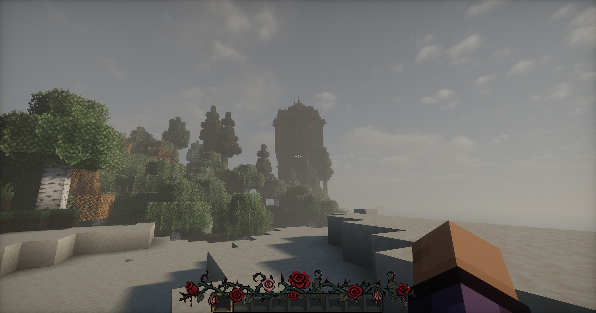
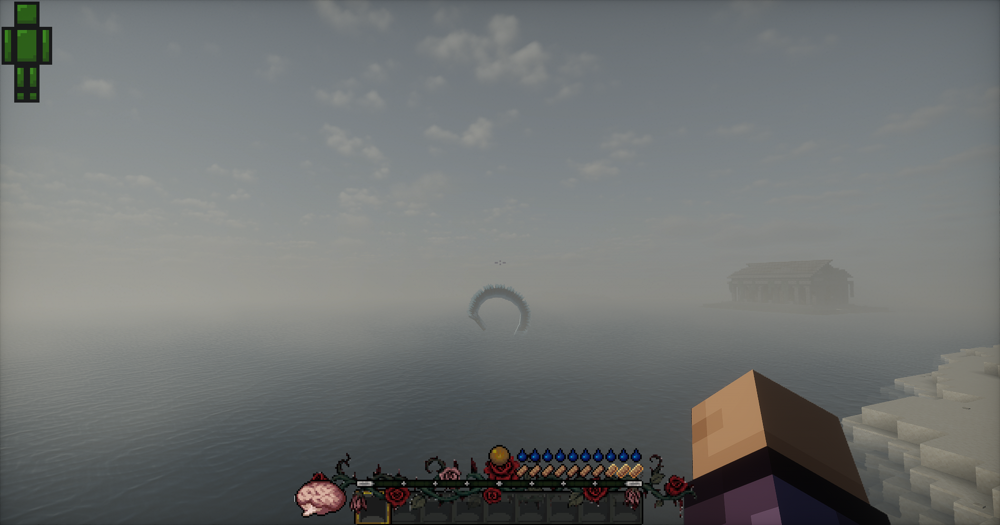
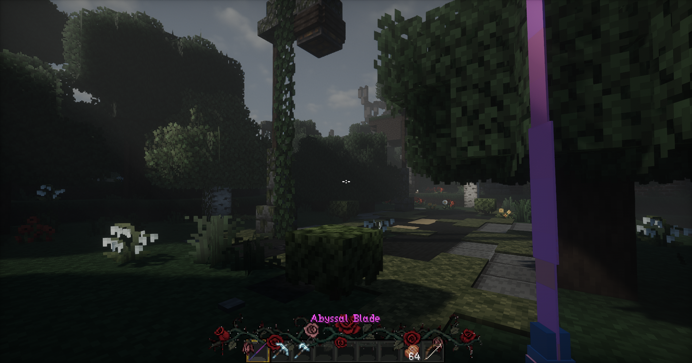
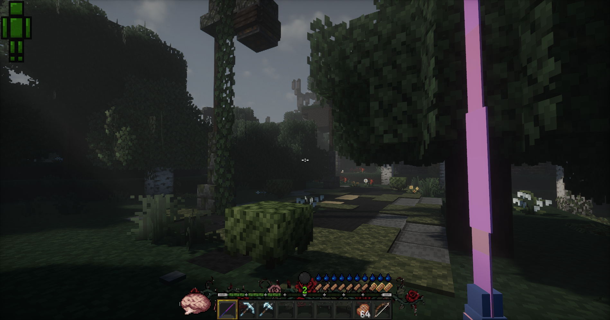
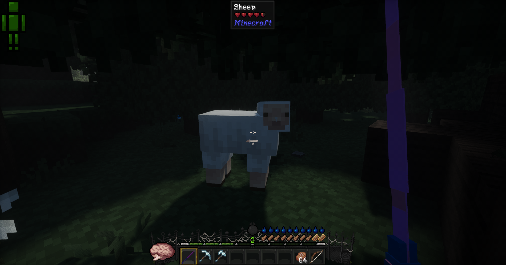

# CustomHotbar

CustomHotbar is a Forge client-side mod that lets you decorate the vanilla Minecraft hotbar with custom underlay and overlay textures.

It supports bundled textures, configurable texture paths, KubeJS asset loading, and an in-game reload command for quickly testing config or texture changes.

## Features

- Custom hotbar underlay texture
- Custom hotbar overlay texture
- Configurable X/Y positioning
- Configurable texture dimensions
- Configurable texture resource paths
- Bundled fallback textures
- KubeJS asset support
- Client-side reload command
- Forge GUI overlay ordering support

## Screenshots
<table align="center">
  <tr>
    <td align="center" width="50%">
      
      <br />
    </td>
    <td align="center" width="50%">
      
      <br />
    </td>
  </tr>

  <tr>
    <td align="center" width="50%">
      
      <br />
    </td>
    <td align="center" width="50%">
      
      <br />
    </td>
  </tr>

  <tr>
    <td align="center" colspan="2">
      
      <br />
    </td>
  </tr>
</table>

## Requirements

- Minecraft 1.20.1
- Forge 47.x
- KubeJS for Forge 1.20.1

## Installation

Place the mod jar into your Minecraft `mods` folder:

```text
{instance}/mods/customhotbar-1.0.0.jar
````

Since this mod depends on KubeJS, KubeJS must also be installed:

```text
{instance}/mods/kubejs-forge-*.jar
```

## Default Assets

The mod includes textures inside the jar, although these are transparent by default:

```text
assets/customhotbar/textures/gui/underlay.png
assets/customhotbar/textures/gui/overlay.png
```

These are used automatically when no custom texture paths are configured, or when the configured texture cannot be found.

## KubeJS Asset Support

You can provide custom textures through KubeJS assets.

Example folder structure:

```text
.minecraft/
  kubejs/
    assets/
      ce/
        textures/
          image/
            hotbar/
              underlay.png
              overlay.png
```

Example resource locations:

```text
ce:textures/image/hotbar/underlay.png
ce:textures/image/hotbar/overlay.png
```

## Configuration

After launching the game once, the client config file will be generated:

```text
{instance}/config/customhotbar-client.toml
```

Example config:

```toml
[hotbar]
enabled = true

# Horizontal offset from centered hotbar position.
x_offset = 0

# Vertical offset from vanilla hotbar position.
y_offset = 0

# Overlay texture width.
width = 256

# Overlay texture height.
height = 55

# Leave blank to use the bundled default underlay.
underlay_path = ""

# Leave blank to use the bundled default overlay.
overlay_path = ""
```

Example using KubeJS textures:

```toml
[hotbar]
enabled = true
x_offset = 0
y_offset = 0
width = 256
height = 55
underlay_path = "ce:textures/image/hotbar/underlay.png"
overlay_path = "ce:textures/image/hotbar/overlay.png"
```

## Reloading

Use the in-game command:

```text
/customhotbar reload
```

## Overlay Layering

CustomHotbar renders in two parts:

```text
underlay -> vanilla hotbar/items -> overlay
```

The underlay is registered using Forge's lowest overlay ordering so it renders as far behind the hotbar as possible.

The overlay renders above the vanilla hotbar, but below items and other UI elements.

This allows textures like frames, borders, highlights, or decorations to appear above the hotbar while the background stays behind items and other normal GUI elements.

## Building

Run:

```bash
.\gradlew build
```

The compiled jar will be generated in:

```text
build/libs/
```

## License

[LICENSE]
